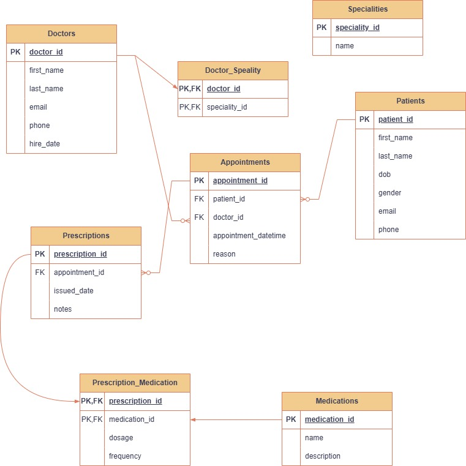

# CLINIC-BOOKING SYSTEM

The project is part of the Power Learn Project database module. It includes an Entity-Relationship Diagram (ERD) and SQL file to design and implement a database for a clinic-booking system.

---

## 📄 Description

The Clinic Booking System is a relational database solution built in MySQL that manages the core operations of a small medical clinic. It helps organize and track:

Patient Records – storing personal and contact information.

Doctor Profiles – including specialties through a many-to-many relationship.

Appointments – scheduling and linking patients with doctors.

Prescriptions – generated for appointments, linked to multiple medications.

Medications – tracked for dosage and frequency per prescription.

###### It supports various types of queries, such as:

Counting appointments per doctor or per day

Tracking the most frequently prescribed medications

Analyzing patient visit frequency

The system is designed with normalization and real-world constraints in mind (primary/foreign keys, NOT NULL, UNIQUE), making it a reliable backend for any clinical or health management application.

It models real-world clinic workflows, enabling insights like appointment statistics, prescription tracking, and doctor-patient interactions.

---

## ⚙️ How to Set Up and Run the Project

### 1. 📦 Importing the Database
1. Open **MySQL Workbench**, **phpMyAdmin**, or **MySQL CLI**.
2. Create the database:
   ```sql
   CREATE DATABASE ClinicDB;
   USE ClinicDB;

---

## 🗃️ Database Tables

Key tables in the schema:
- `Patients`
- `Doctors`
- `Appointments`
- `Specialities`
- `Doctor-Specialty`
- `Prescriptions`
- `Medications`
- `Prescription-Medication`

---

## 🧩 ERD (Entity-Relationship Diagram)

  
> The ERD illustrates all tables, relationships, primary keys, and foreign keys used in the database.

---

## ⚙️ Files

| File | Description |
|------|-------------|
| `clinic_booking_system.sql` | SQL script to create all tables and constraints |
| `System-ERD.jpg` | Visual diagram of the database schema |
